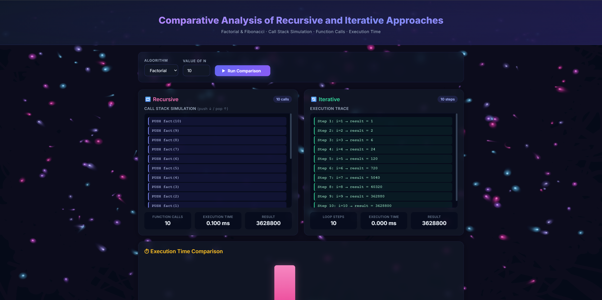
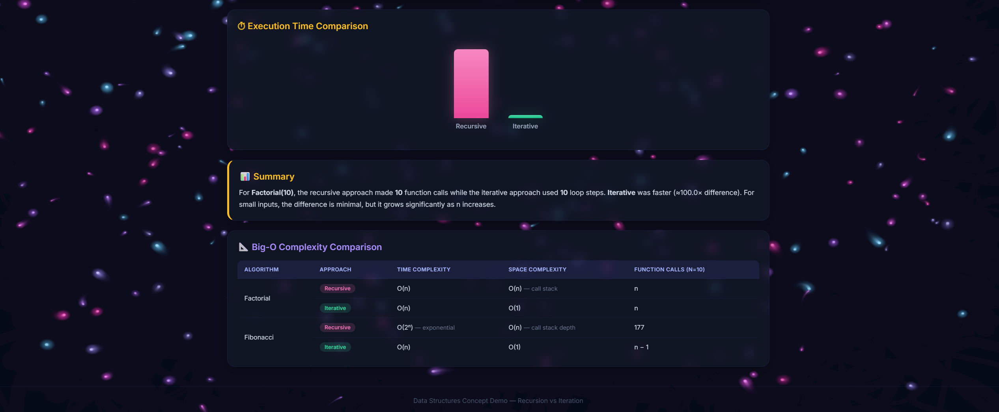

# Recursive vs Iterative Visualizer

An interactive web-based tool that demonstrates the **comparative analysis of recursive and iterative approaches** for Factorial and Fibonacci algorithms.

## 🔗 Live Demo

**[https://rajmane4-boop.github.io/recursive-vs-iterative-visualizer/](https://rajmane4-boop.github.io/recursive-vs-iterative-visualizer/)**

## ✨ Features

- **Call Stack Simulation** — visualizes PUSH / POP operations for recursive calls
- **Execution Trace** — step-by-step trace of iterative loop execution
- **Function Call Counter** — animated count-up comparing call counts
- **Execution Time Comparison** — side-by-side bar chart with grow animation
- **Big-O Complexity Table** — theoretical time & space complexity reference
- **Auto-generated Summary** — natural-language comparison of results
- **Input Validation** — prevents browser freeze on large Fibonacci values (n ≤ 20)

## 🎨 Design

- Premium dark theme with glassmorphism cards
- **Swirl particle background** — 300 noise-driven particles with trailing glow
- 3D card tilt on hover
- Scroll-triggered fade-in animations
- Shimmer gradient header text
- Button ripple & pulse effects
- Fully responsive layout
- `prefers-reduced-motion` support

## 🛠 Tech Stack

- HTML5 / CSS3 / Vanilla JavaScript
- No frameworks or libraries — zero dependencies

## 📸 Screenshots





## 🚀 Getting Started

```bash
git clone https://github.com/rajmane4-boop/recursive-vs-iterative-visualizer.git
cd recursive-vs-iterative-visualizer
# Open index.html in your browser
```

## 📄 License

This project is licensed under the [MIT License](LICENSE).
